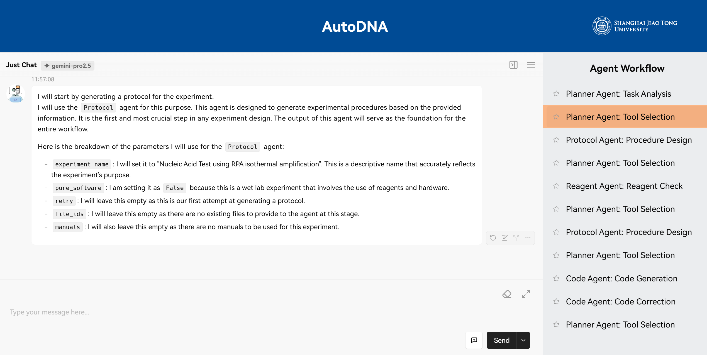

# AutoDNA - Automated DNA Laboratory System
 


AutoDNA is a comprehensive multi-component system designed for automated DNA and chemical experiments in laboratory environments. The system combines AI-powered protocol generation, web-based user interfaces, hardware scheduling, and low-level hardware control to create a complete end-to-end solution for molecular biology automation.

- [System requirements](#software-prerequisites)
  - [Software dependencies and versions](#software-prerequisites)
  - [non-standard hardware requirements](#hardware-requirements)
- [Installation guide](#installation)
- [Instructions for use](#running-the-system)
  - [Running the software and reproductions](#running-the-system)
  - [Demo](#demo)

## System Overview
AutoDNA consists of four main components working together to provide a seamless laboratory automation experience:

1. **UI** - Web-based frontend interface built on LobeChat framework
2. **AutoDNA-python** - AI-powered multi-agent system for protocol generation and execution
3. **Scheduler** - C++ scheduler for hardware coordination and workflow management
4. **Firmware** - C# and PLC (Programmable Logic Controller) programs that control the physical laboratory hardware and workstations.

## 🏗️ Architecture


```
┌──────────────┐   HTTP/WebSocket   ┌────────────────┐   JSON Protocol   ┌───────────────┐   PLC Commands   ┌──────────────┐
│      UI      │ ◄────────────────► │ AutoDNA-python │ ◄───────────────► │   Scheduler   │ ◄──────────────► │   Firmware   │
│  (Frontend)  │                    │  (AI Engine)   │                   │ (C++ Backend) │                  │ ( PLC & C# ) │
└──────────────┘                    └────────────────┘                   └───────────────┘                  └──────────────┘
       │                                     │                                      │                              │
       │                                     │                                      │                              │
       ▼                                     ▼                                      ▼                              ▼
┌──────────────┐                    ┌────────────────┐                   ┌────────────────┐                   ┌──────────────┐
│User Interface│                    │   AI Agents    │                   │Hardware Control│                   │  Laboratory  │
│ - Workflow   │                    │   - Protocol   │                   │ - Scheduling   │                   │  Hardware    │
│ - Monitoring │                    │   - Literature │                   │ - Coordination │                   │  - Machines  │
│ - ...        │                    │   - Code       │                   │ - ...          │                   │  - Stations  │
└──────────────┘                    │   - ...        │                   └────────────────┘                   │  - ...       │
                                    └────────────────┘                                                        └──────────────┘
```


## Quick Start

### Software Prerequisites

- **Operating System**: Recommended and tested exclusively on **Ubuntu 22.04**.
- **Node.js 18+** (for UI component)
- **pnpm 9.5+** (for UI component)
- **Python 3.11+** (for AutoDNA-python)
- **C++17 compatible compiler** (for Scheduler)
- **CMake 3.5+** (for building Scheduler)
- **Google Gemini API key** (for AI functionality)

Refer to the README files in submodules for more dependency information, especially the [libraries](./Scheduler/README.md) required for Scheduler.

### Hardware Requirements

- **Laboratory Equipment**: Equipment that complies with a set of APIs such as:
  - Robot arms
  - Heater shakers
  - Fluorometers
  - Centrifuges
  - And more...

Without these hardware components, you can still run the system with limited functionality.

### Firmware Requirements

If you have real hardware, refer to the [README](./Firmware/README.md) for the firmware to configure the working stations accordingly.
Otherwise, you can safely skip this section.

### Installation
> **Note**: The entire installation process is expected to take approximately 1 hour.

#### 1. Clone the Repository
```bash
git clone <repository-url>
```

#### 2. Setup UI Component
```bash
cd UI
pnpm install
```

#### 3. Setup AutoDNA-python Component
```bash
cd AutoDNA-python
pip install -r requirements.txt
export GEMINI_API_KEY="your-gemini-api-key"
```

#### 4. Setup Scheduler Component
>**Note**: Strongly recommend to run the project on a Linux environment. Not guaranteed to work on other OSes.
```bash
cd Scheduler
mkdir build && cd build
cmake ..
make
```
### Configuration

#### Environment Variables

```bash
# Required for AutoDNA-python
export GEMINI_API_KEY="your-gemini-api-key"
```

#### Scheduler Configuration

The scheduler requires JSON configuration files in the `Scheduler/config/` directory:

- `reagents.json` - Reagent definitions and allocations
- `protocol_flow.json` - Protocol execution steps (automatically generated by AutoDNA-python, no need to edit manually)

#### AutoDNA-python Configuration

Refer to the README file in `AutoDNA-python/` for detailed configuration options.

### Running the System

#### Start the Components (in separate terminals)

1. **Start the Modbus server** (Terminal 1):
```bash
cd Scheduler/build
./bin/main_server
```
This step is for running without real hardware. If you have real hardware, you can skip this step.

2. **Start the Scheduler** (Terminal 2):
```bash
cd Scheduler/build
./bin/main_local_web ../config
```

3. **Start AutoDNA-python** (Terminal 3):
```bash
cd AutoDNA-python/scientist
python server.py
```

4. **Start the UI** (Terminal 4):
```bash
cd UI
pnpm dev
```

Check the README in submodules for additional running instructions.

#### Default Access Points
- **UI Interface**: http://localhost:3010
- **AutoDNA API**: http://localhost:8081
- **Scheduler WebSocket**: http://localhost:8080

Full reproduction is not guaranteed without hardware. Check the next [section](#example-workflows) for reproduction instructions.

## Example Workflows
> **Note**: The runtime for the workflow of dealing with an example prompt is approximately **15 minutes to 1 hour**, before any hardware execution begins.

### Demo
#### Instructions for reproduction
After properly starting the system with correct configurations, you should try the demo with UI to get a better understanding of the system. The prompt is located in `AutoDNA-python/scientist/prompts/user_prompt_rpa.md`. You can copy the content, paste it into the UI and click the "Send" button to run.

#### Expected Results

When running the demo, you would see a similar interface as above. The left panel shows the output of each agent. The right panel shows the workflow. And there's a input field at the bottom of the left panel for you to input initial prompts.

### Other examples
You can try the other examples yourself via either the UI or CLI.
#### Through UI
To run an example, select a prompt from the `AutoDNA-python/scientist/prompts/` folder, paste it into the UI, and click the "Send" button to start. You may still be required to input something occasionally in the CLI. If you are still confused, please refer to the [README](./AutoDNA-python/README.md) in `AutoDNA-python/` for detailed usage.

#### Through CLI:
Refer to the [README](./AutoDNA-python/README.md) in `AutoDNA-python/` for detailed CLI usage.


## Output and Results

The system generates comprehensive outputs:

- **Protocols**: Detailed step-by-step experimental procedures
- **Generated Code**: Executable Python code for laboratory automation
- **Hardware Commands**: Equipment-specific instructions
- **Literature References**: Relevant scientific papers
- **Execution Logs**: Detailed logs of agent interactions and outputs
- **Final Summary**: Concise overview of the experiment and the final results


## Component Details

### UI Component

The frontend provides an intuitive web interface for managing laboratory workflows.

**Key Features:**
- Multi-agent workflow orchestration
- Real-time status monitoring
- Interactive protocol design
- Result visualization and comparison

**Technology Stack:**
- Built on LobeChat framework
- React/Next.js frontend
- WebSocket communication
- Custom workflow routing system

### AutoDNA-python Component

The AI engine that powers intelligent protocol generation and execution.

**Key Features:**
- Multi-agent AI system with specialized agents
- Literature search and analysis
- Protocol design and optimization
- Code generation for laboratory automation

**AI Agents:**
- **Literature Agent**: Scientific literature search and analysis
- **Protocol Agent**: Experimental protocol design
- **Reagent Agent**: Reagent inventory management
- **Code Agent**: Python code generation for automation
- **Hardware Agent**: Laboratory equipment interface
- **Hypothesis Agent**: Experimental hypothesis formulation

**Supported Experiment Types:**
- DNA Synthesis
- RPA-based Nucleic Acid Tests
- RNA Experiments
- DNA storage write operation
- DNA storage read operation
- PolyA Tailing
- And more...


### Scheduler Component

The C++ backend that manages laboratory hardware coordination and workflow execution.

**Key Features:**
- Hardware coordination and scheduling
- Reagent allocation and management
- Real-time workflow monitoring
- WebSocket communication
- Modbus protocol support

**Supported Hardware:**
- Fluorometers
- Thermal cyclers
- Liquid handling systems
- Temperature controllers
- Various laboratory instruments

### Firmware Component

This component contains the C# and PLC programs that directly control the laboratory hardware and workstations. It acts as the critical bridge between the high-level commands from the Scheduler and the physical actions of the devices, ensuring precise and reliable execution of experimental steps.

## Supporting Parts

### Data
This [part](./Data/README.md) contains all original data used in the paper as well as the output of every LLM agent for every experiment listed in the paper. The codes and programs for processing the data are also included. 


## Troubleshooting

### Common Issues

1. **Connection Issues**: Ensure all components are running and ports are available
2. **API Key**: Verify GEMINI_API_KEY is set correctly
3. **Dependencies**: Check that all required libraries are installed
4. **Configuration**: Verify config files are present and properly formatted
5. **Clear output**: Delete previous output folders when running new experiments


## License

This project is licensed under the terms specified in the LICENSE file.

## Scientific Applications

AutoDNA is designed for:

- **Research Laboratories**: Automated protocol design and execution
- **Biotechnology Companies**: Streamlined experimental workflows
- **Educational Institutions**: Teaching molecular biology concepts
- **Diagnostic Labs**: Rapid assay development and testing
- **Synthetic Biology**: Automated DNA synthesis and manipulation

---

**Note**: This system is designed for research and educational purposes. Always follow proper laboratory safety protocols and regulations when using automated systems.
